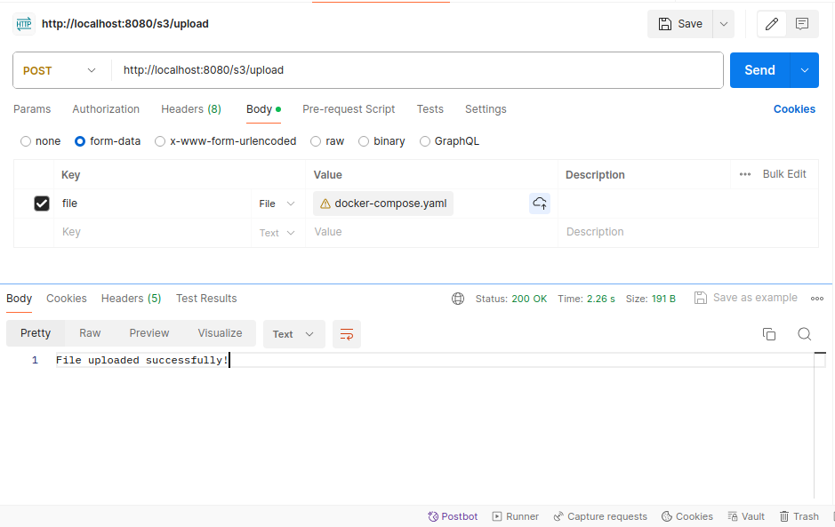
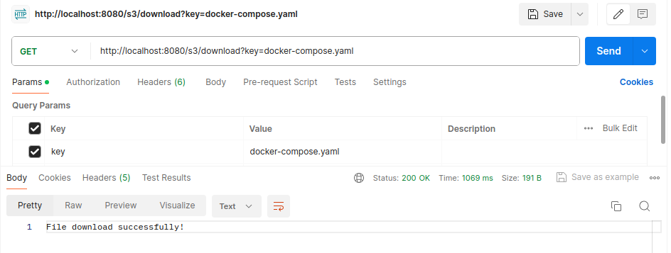

<h1 align="center" style="color: red">StorageS3Service</h1>

<p>Данный микросервис StorageS3Service для работы с S3 хранилищем использует REST API.</p>

<h3>Используемый стек технологий:</h3>
<li>Java 17</li>
<li>Spring Boot</li>
<Li>Lombok</Li>
<li>Amazon SDK</li>
<li>Commons-IO</li>

<p>Для настройки микросервиса необходимо внести в конфигурационный файл application.yaml следующие настройки:</p>
<li style="color: #00FFFF">cloud.s3.bucket-name: ${название Вашей корзины}</li>
<li style="color: #00FFFF">cloud.s3.accessKeyId: ${access key - Key ID ключа доступа к корзине}</li>
<li style="color: #00FFFF">cloud.s3.secretKey: ${secret key - Секретный ключ ключа доступа}</li>
<li style="color: #00FFFF">cloud.s3.region: ${Указать свой регион}</li>
<li style="color: #00FFFF">cloud.s3.endpoint: ${Указать endpoint своего S3 хранилища}</li>

<p>Документацию по API можно узнать в Swagger. При запуске приложения перейти по адресу: http://localhost:8080/swagger-ui/index.html</p>
<h2 align="center">Тестирование в Postman</h2>
<p>Для тестирования метода POST необходимо в Postman создать новый метод post указать url http://localhost:8080/s3/upload <br>
Во вкладке Body выбрать form-data  (key = "file", value = "Выбрать файл") и выполнить запрос <br>
В корзине будет создана папка s3 где будут храниться файлы. Для изменения названия папки необходимо в классе контроллера S3Controller <br>
в аннотации @RequestMapping("/folder")
</p>


<p>Для тестирования метода GET, необходимо создать новый запрос. Указать url http://localhost:8080/s3/download указать в параметрах<br>
key = key, value = "название файла(my-file.pdf)" и выполнить запрос. Файл загрузится в папку Download.
</p>


<h3>Запуск сервиса в docker - контейнере</h3>
<p>Откройте терминал, перейдите в каталог приложения и выполните команду:

```
    docker build -t storage-s3-service:v1
```

После выполнения команды выполните проверку созданного образа:</p>

```
    docker images
```

<p>Для запуска образа выполните команду:</p>

```
    docker run -it -p 8080:8080 storage-s3-service
```

<p>Все основные команды для работы, можно изучить на официальном сайте <a href="https://www.docker.com">Docker</a> </p>
<p>Данный сервис был успешно протестирован на S3 хранилище в <a href="https://cloud.ru">Cloud.ru</a></p>


